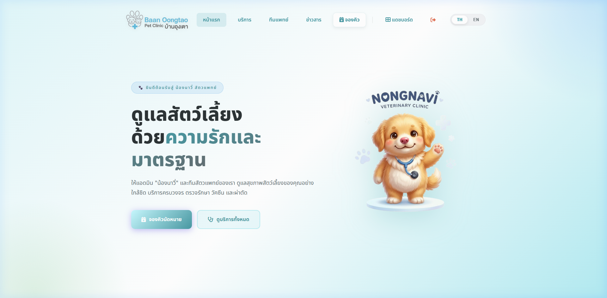
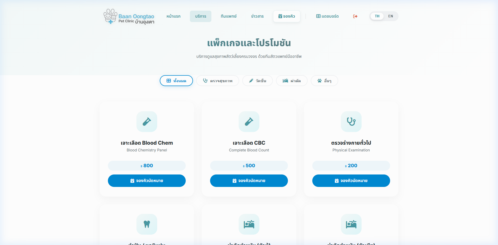
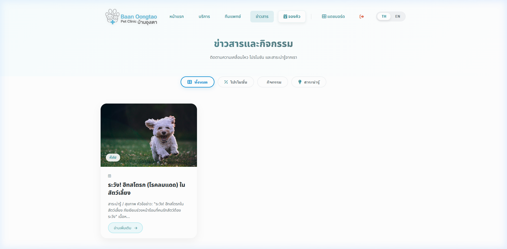
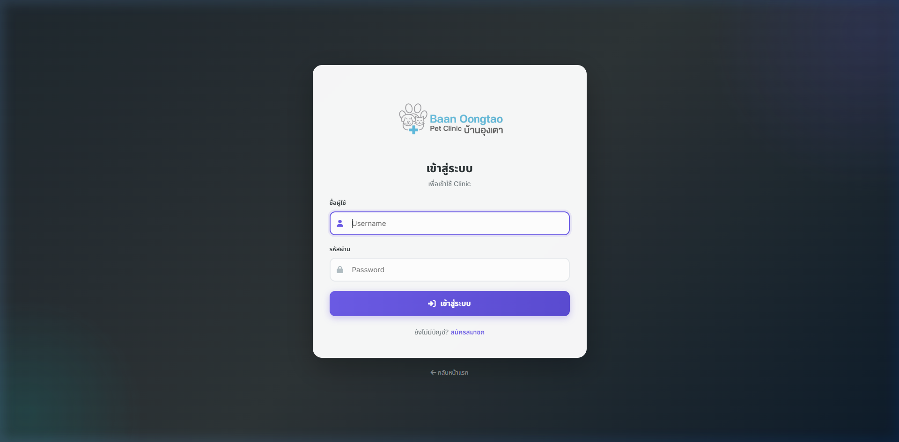
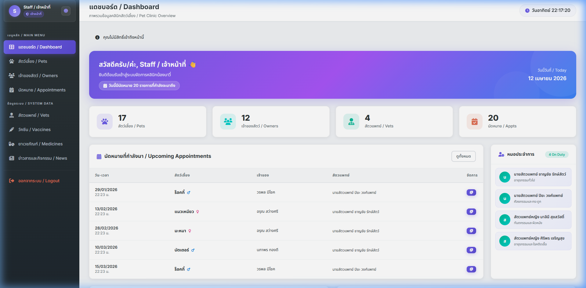
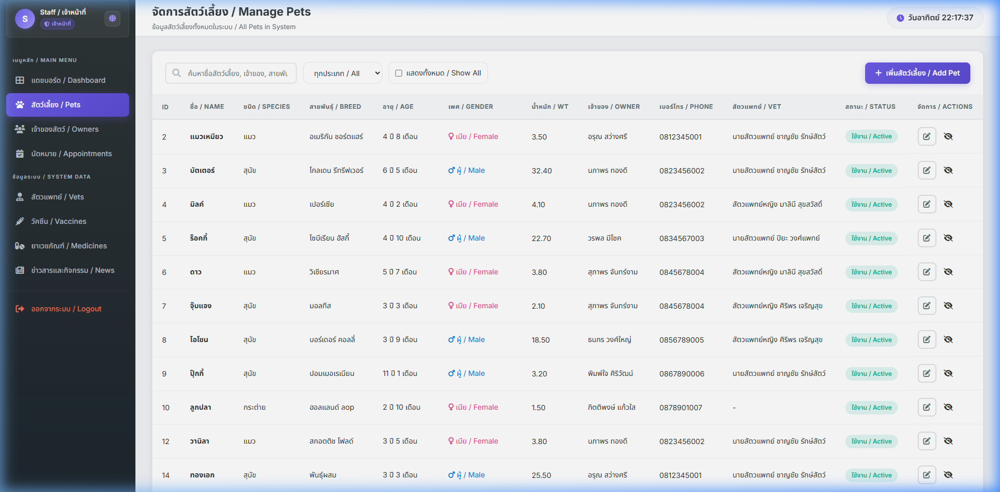
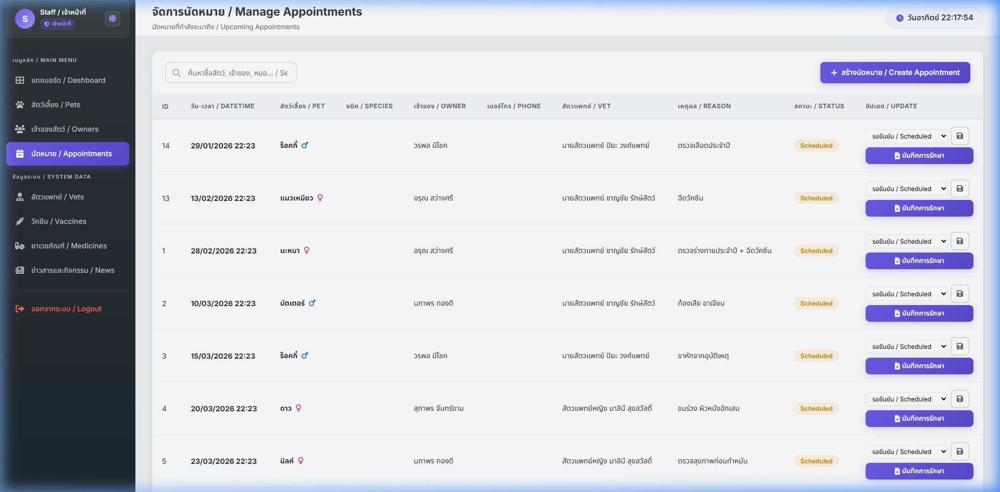
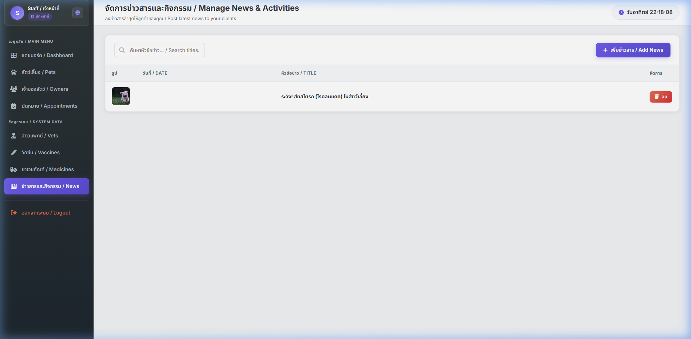

# 🏥 NongNavi Veterinary Clinic — ระบบจัดการคลินิกสัตว์แพทย์

<p align="center">
  
</p>

<p align="center">
  <strong>ระบบจัดการคลินิกสัตว์เลี้ยง NongNavi (น้องนาวี่) สัตวแพทย์</strong><br>
  พัฒนาด้วย Django Framework + Microsoft SQL Server
</p>

---

## 📋 สารบัญ

- [เกี่ยวกับโปรเจกต์](#-เกี่ยวกับโปรเจกต์)
- [เทคโนโลยีที่ใช้](#-เทคโนโลยีที่ใช้)
- [การติดตั้ง](#-การติดตั้ง)
- [การตั้งค่า](#-การตั้งค่า)
- [การใช้งาน](#-การใช้งาน)
- [หน้าเว็บไซต์](#-หน้าเว็บไซต์)
- [โครงสร้างโปรเจกต์](#-โครงสร้างโปรเจกต์)

---

## 📖 เกี่ยวกับโปรเจกต์

ระบบจัดการคลินิกสัตว์เลี้ยง **NongNavi** เป็นเว็บแอปพลิเคชันที่ออกแบบมาเพื่อช่วยจัดการงานภายในคลินิกสัตวแพทย์ ทั้งฝั่ง **ลูกค้า (Public)** และ **ผู้ดูแลระบบ (Admin Panel)** ครอบคลุมตั้งแต่การนัดหมาย, จัดการสัตว์เลี้ยง, บันทึกการรักษา, ไปจนถึงการจัดการสต็อกวัคซีนและยา

### ✨ ฟีเจอร์หลัก

**ฝั่งลูกค้า (Public)**
- 🏠 หน้าแรกแสดงข้อมูลคลินิก บริการ และทีมสัตวแพทย์
- 📋 จองคิวนัดหมายออนไลน์
- 👨‍⚕️ ดูข้อมูลสัตวแพทย์ประจำคลินิก
- 💊 ดูรายการบริการและราคา (พร้อม Filter หมวดหมู่)
- 📰 ข่าวสารและกิจกรรม (พร้อม Filter หมวดหมู่ + รูปภาพ)
- 📄 หน้า My Page — ตรวจสอบนัดหมายและสัตว์เลี้ยงของตนเอง

**ฝั่ง Admin Panel**
- 📊 Dashboard แสดงสถิติรวม (สัตว์เลี้ยง, เจ้าของ, นัดหมาย, สัตวแพทย์)
- 🐾 จัดการข้อมูลสัตว์เลี้ยง (เพิ่ม/แก้ไข)
- 👥 จัดการข้อมูลเจ้าของสัตว์เลี้ยง
- 📅 จัดการนัดหมาย + บันทึกการรักษา
- 💉 จัดการวัคซีน (เพิ่ม/เติมสต็อก/บันทึกการฉีด)
- 💊 จัดการยาและเวชภัณฑ์
- 👨‍⚕️ จัดการข้อมูลสัตวแพทย์
- 📰 จัดการข่าวสารและกิจกรรม
- 🔒 ระบบสิทธิ์ผู้ใช้ (Admin / Vet / Owner)

---

## 🛠 เทคโนโลยีที่ใช้

| เทคโนโลยี | รายละเอียด |
|---|---|
| **Backend** | Python 3.9 + Django 4.2 |
| **Database** | Microsoft SQL Server (via `mssql-django`) |
| **Frontend** | HTML5, CSS3 (Vanilla CSS), JavaScript |
| **Icons** | Font Awesome 6 |
| **Fonts** | Google Fonts (Inter, Noto Sans Thai) |
| **Authentication** | Custom Backend + Django Auth |
| **Deployment** | Render (Production) / Local (Development) |

---

## 🚀 การติดตั้ง

### ข้อกำหนดเบื้องต้น (Prerequisites)

1. **Python 3.9+** — [ดาวน์โหลด](https://www.python.org/downloads/)
2. **SQL Server** (Express หรือ Developer) — [ดาวน์โหลด](https://www.microsoft.com/en-us/sql-server/sql-server-downloads)
3. **ODBC Driver 17** for SQL Server — [ดาวน์โหลด](https://docs.microsoft.com/en-us/sql/connect/odbc/download-odbc-driver-for-sql-server)
4. **Git** — [ดาวน์โหลด](https://git-scm.com/)

### ขั้นตอนการติดตั้ง

```bash
# 1. Clone โปรเจกต์
git clone https://github.com/nuttaponwon-creator/Clinic.git
cd Clinic

# 2. สร้าง Virtual Environment (แนะนำ)
python -m venv venv
venv\Scripts\activate    # Windows
# source venv/bin/activate  # macOS/Linux

# 3. ติดตั้ง Dependencies
pip install -r requirements.txt
```

---

## ⚙️ การตั้งค่า

### 1. ตั้งค่าฐานข้อมูล (Database)

เปิดไฟล์ `myclinic/settings.py` แล้วแก้ไขส่วนเชื่อมต่อฐานข้อมูล:

```python
DATABASES = {
    'default': {
        'ENGINE': 'mssql',
        'NAME': 'PetClinicDB',                    # ชื่อฐานข้อมูล
        'HOST': 'YOUR_SERVER\\SQLEXPRESS',         # ชื่อ SQL Server ของคุณ
        'USER': 'sa',                              # Username
        'PASSWORD': 'your_password',               # Password
        'OPTIONS': {
            'driver': 'ODBC Driver 17 for SQL Server',
            'extra_params': 'TrustServerCertificate=yes;',
        },
    }
}
```

### 2. สร้างฐานข้อมูล

สร้างฐานข้อมูล `PetClinicDB` ใน SQL Server Management Studio (SSMS) หรือใช้คำสั่ง SQL:

```sql
CREATE DATABASE PetClinicDB;
```

### 3. รันเซิร์ฟเวอร์

```bash
python manage.py runserver
```

เข้าเว็บไซต์ที่: **http://127.0.0.1:8000/**

---

## 📱 การใช้งาน

### สำหรับลูกค้า (Public)
1. เข้าที่ `http://127.0.0.1:8000/` เพื่อดูหน้าแรกของคลินิก
2. สมัครสมาชิก / เข้าสู่ระบบ ที่หน้า Login
3. จองคิวนัดหมายออนไลน์ผ่านหน้า "จองคิว"
4. ตรวจสอบสถานะนัดหมายและสัตว์เลี้ยงของตัวเองที่หน้า "My Page"

### สำหรับผู้ดูแลระบบ (Admin)
1. เข้าสู่ระบบด้วยบัญชี Admin หรือ Vet
2. เข้าหน้า Dashboard ที่ `http://127.0.0.1:8000/admin-panel/`
3. จัดการข้อมูลต่างๆ ผ่าน Sidebar เมนู

### ระดับสิทธิ์ผู้ใช้

| สิทธิ์ | คำอธิบาย |
|---|---|
| **Admin** | เข้าถึงได้ทุกฟีเจอร์ รวมถึงการจัดการสต็อกวัคซีน/ยา |
| **Vet (สัตวแพทย์)** | เข้าถึง Dashboard, จัดการนัดหมาย, บันทึกการรักษา (ไม่สามารถเติมสต็อกได้) |
| **Owner (เจ้าของ)** | ดูข้อมูลฝั่ง Public, จองคิวนัดหมาย, ตรวจสอบประวัติสัตว์เลี้ยงตนเอง |

---

## 🖥 หน้าเว็บไซต์

### ฝั่งลูกค้า (Public Pages)

#### 🏠 หน้าแรก (Homepage)
> แสดงข้อมูลคลินิก, บริการ, และทีมสัตวแพทย์



#### 💊 บริการของเรา (Services)
> รายการบริการพร้อมราคา + Filter หมวดหมู่



#### 📰 ข่าวสารและกิจกรรม (News)
> ข่าวสาร โปรโมชัน สาระน่ารู้ + รูปภาพ



#### 🔐 เข้าสู่ระบบ (Login)
> หน้า Login สำหรับทุก Role



---

### ฝั่งผู้ดูแลระบบ (Admin Panel)

#### 📊 Dashboard
> ภาพรวมสถิติ นาฬิกา Live และ Shortcut ต่างๆ



#### 🐾 จัดการสัตว์เลี้ยง (Pets)
> เพิ่ม แก้ไข ค้นหาข้อมูลสัตว์เลี้ยง



#### 📅 จัดการนัดหมาย (Appointments)
> ดูตาราง อัปเดตสถานะ บันทึกการรักษา



#### 📰 จัดการข่าวสาร (News Management)
> เพิ่ม ลบข่าวสาร โปรโมชัน กิจกรรม



---

## 📁 โครงสร้างโปรเจกต์

```
myclinic/
├── core/                          # Django App หลัก
│   ├── static/
│   │   ├── css/
│   │   │   ├── style.css          # CSS สำหรับ Admin Panel
│   │   │   └── public.css         # CSS สำหรับหน้า Public
│   │   └── images/                # โลโก้และรูปภาพ
│   ├── templates/
│   │   ├── public/                # Templates หน้าลูกค้า
│   │   │   ├── base_public.html
│   │   │   ├── home.html
│   │   │   ├── services.html
│   │   │   ├── doctors.html
│   │   │   ├── news.html
│   │   │   ├── booking.html
│   │   │   └── my_page.html
│   │   ├── auth/                  # Templates Login/Register
│   │   ├── base.html              # Base template (Admin)
│   │   ├── dashboard.html
│   │   ├── pets.html
│   │   ├── owners.html
│   │   ├── appointments.html
│   │   ├── vaccines.html
│   │   ├── medicines.html
│   │   └── ...
│   ├── backends.py                # Custom Authentication Backend
│   ├── context_processors.py      # User Role Context
│   ├── urls.py                    # URL Routing
│   └── views.py                   # View Functions (All Logic)
├── myclinic/                      # Django Project Config
│   ├── settings.py                # ⚙️ การตั้งค่าหลัก (DB, Auth, etc.)
│   └── urls.py
├── locale/                        # ไฟล์แปลภาษา (TH/EN)
├── manage.py
├── requirements.txt
├── .gitignore
└── README.md
```

---

## 👨‍💻 ผู้พัฒนา

พัฒนาโดย **ทีมพัฒนา NongNavi Clinic**

---

## 📝 License

This project is for educational purposes.
